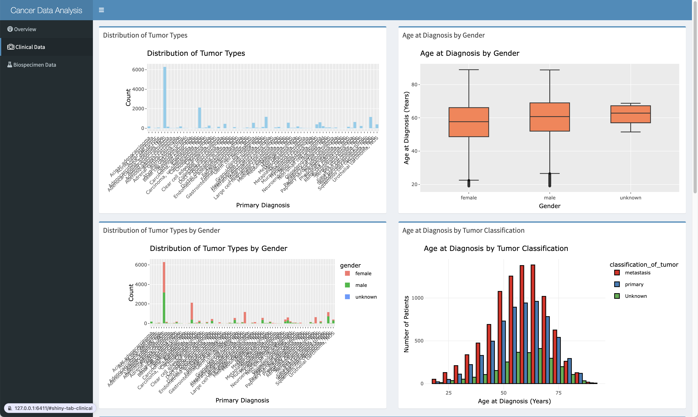
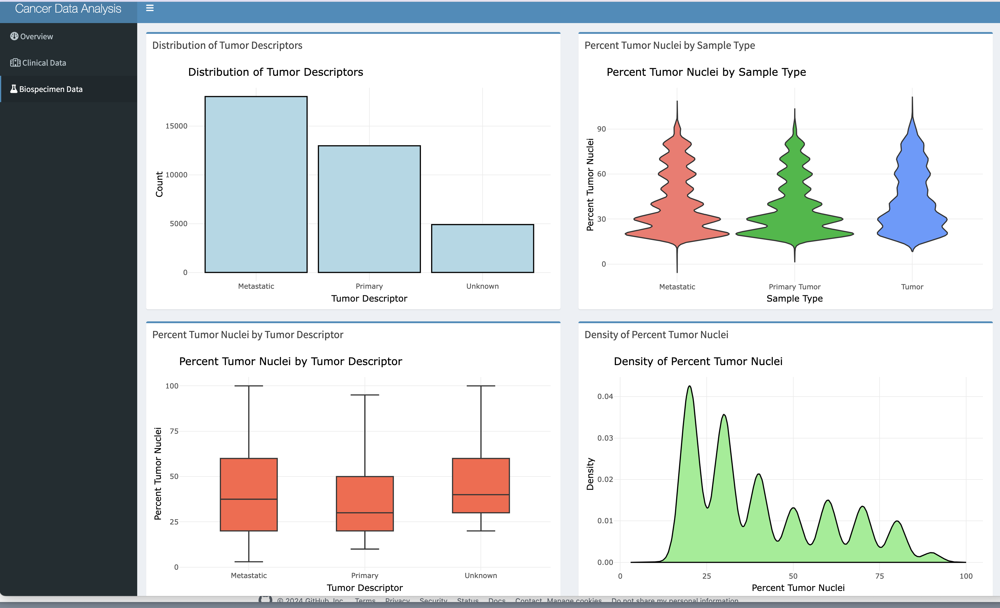

# Cancer Data Analysis Dashboard

This project contains a R Shiny application designed to provide exploratory data analysis (EDA) and interactive visualizations for cancer-related clinical and biospecimen datasets. The application presents data on tumor types, diagnosis, and biospecimen samples, allowing users to explore distributions, gender-based comparisons, and data trends across various categories.

## Table of Contents
* Overview
* Directory Structure
* Installation
* Data
* Code
* EDA_biospecimen.R
* EDA_clinical.R
* app.R
* Usage
* Running the App
* Screenshots
* Contributing
* License


## Overview
The Cancer Data Analysis Dashboard is an interactive application that allows users to visualize and explore cancer-related data. This project contains three R scripts: `EDA_biospecimen.R`, `EDA_clinical.R`, and `app.R`, along with two datasets. The dashboard enables users to analyze various aspects of tumor types, diagnoses, and biospecimen samples. It also includes gender and tumor classification comparisons.

The app includes:

* Clinical Data Visualizations:
    * Distribution of Tumor Types
    * Age at Diagnosis by Gender
    * Distribution of Tumor Types by Gender
    * Age at Diagnosis by Tumor Classification
* Biospecimen Data Visualizations:
    * Distribution of Tumor Descriptors
    * Percent Tumor Nuclei by Sample Type
    * Percent Tumor Nuclei by Tumor Descriptor
    * Density of Percent Tumor Nuclei


```
/cancer-data-analysis
│
├── /data
│   ├── FM-AD Clinical Project 2024-09-07.json
│   ├── FM-AD Biospecimen 2024-09-08.json
│
├── /R
│   ├── EDA_biospecimen.R
│   ├── EDA_clinical.R
│   ├── app.R
│
└── /screenshots
    ├── Screenshot 1.png
    ├── Screenshot 2.png
```

## Installation
### Prerequisites
* R: Install R from https://cran.r-project.org/
* RStudio: (optional) Recommended for development
* Shiny: Install Shiny by running the following command in your R console:

    ```install.packages("shiny")```
### Clone the Repository
To get started, clone this repository to your local machine:

```
git clone https://github.com/your-repo/cancer-data-analysis.git
cd cancer-data-analysis`
```

## #Required R Libraries
Install the following libraries before running the application:

```
install.packages(c("shiny", "ggplot2", "dplyr", "tidyr", "purrr", "DT", "shinydashboard", "treemap", "lubridate", "plotly", "highcharter", "dygraphs"))
```

## Data
### Clinical Data: ```FM-AD Clinical Project 2024-09-07.json```
This dataset contains clinical information about patients, including diagnoses, demographic details (such as gender and ethnicity), and age at diagnosis. It is used in the Clinical Data tab of the dashboard to explore tumor types and patient demographics.

### Biospecimen Data: ```FM-AD Biospecimen 2024-09-08.json```
This dataset contains biospecimen-related information, such as tumor descriptors, sample types, and tumor nuclei percentages. It is visualized in the Biospecimen Data tab of the dashboard.

## Code
### EDA_biospecimen.R
This script handles the Exploratory Data Analysis (EDA) for the biospecimen dataset. It performs the following tasks:

* Data Loading: Reads the biospecimen data from the JSON file.
* Data Cleaning: Unnests nested fields like ```samples```, ```portions```, ```slides```, and ```analytes```.
* Visualizations:
    * Distribution of tumor descriptors.
    * Percent tumor nuclei by tumor descriptor.
    * Density and violin plots for tumor nuclei percentages.
### EDA_clinical.R
This script handles the Exploratory Data Analysis (EDA) for the clinical dataset. It performs the following tasks:

* Data Loading: Reads the clinical data from the JSON file.
* Data Cleaning: Unnests fields like ```diagnoses``` and ```demographic```, replaces missing values, and calculates age at diagnosis in years.
* Visualizations:
    * Tumor types distribution.
    * Age at diagnosis by gender.
    * Tumor types distribution by gender.
    * Age at diagnosis by tumor classification.
### app.R
This script builds the R Shiny application that combines the visualizations from ```EDA_biospecimen.R``` and ```EDA_clinical.R```. It contains the following components:

* UI Layout: Uses the ```shinydashboard``` package to create a multi-tab layout, with one tab for clinical data and another for biospecimen data.
* Server Logic: Defines the rendering logic for each plot and data table. It also uses the ```plotly``` library to make the visualizations interactive.

## Usage
### Running the App
To run the Shiny app, follow these steps:

1. Open RStudio (or any R IDE).

2. Set the working directory to the folder containing the app.R file.

3. Run the app by executing the following command in your R console:


```runApp("path/to/your/app/folder")```
The app will launch in your browser.

## Screenshots
### Clinical Data Tab


### Biospecimen Data Tab


## Contributing
Contributions are welcome! Please open an issue or submit a pull request with your changes. Make sure to include a detailed description of the changes you have made.
